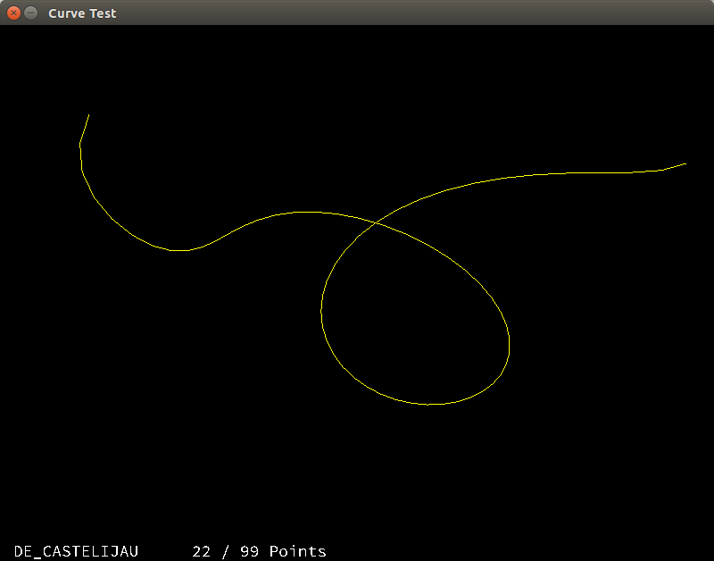

# Ada Curve


Fun and experimentation with curve drawing algorithms using Ada.



## Currently Implemented

* De Castelijau
* De Boor
* Catmull Rom
* Lagrange interplation on equidistant nodes
* Lagrange interpolation on Chavyshev nodes

## Dependencies

One needs to install cmake to build glfw3 and gprbuild to build OpenGLAda. 

## Build

The command ```make``` will execute:

```bash
gprbuild  -p -P adacurve.gpr -XWindowing_System=x11 -XGLFW_Version=3
```

## Run

The command ```make run``` will execute:

```bash
./bin/main ./OpenGLAda/tests/ftgl/SourceCodePro-Regular.ttf
```

Path to the font file is optional and is required only for displaying the text on the screen.

* Press and hold ```H``` to view help information.
* Right-click on an empty locating to add a control point there.
* Right-click on a control point to delete it.
* Left-click and drag control point to move it.
* Press ```A``` to cycle through different algorithms.
* Press ```P``` to toggle control points and control polygon.
